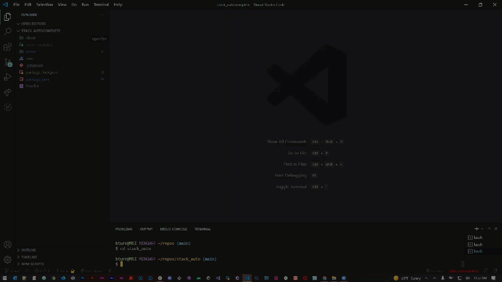

<link rel="preconnect" href="https://fonts.googleapis.com">
<link rel="preconnect" href="https://fonts.gstatic.com" crossorigin>
<link href="https://fonts.googleapis.com/css2?family=Open+Sans&family=Orbitron:wght@777&family=Roboto+Mono:wght@500&display=swap" rel="stylesheet">

# <p align="center"> **Stack AutoComplete**
#### <p align="center">Project 3: Get Mern Smacked
 
</p>

<p align="center">
 
  
 
</p>


## Description

Stack Autocomplete is a public platform that aims to build a community driven knowledge Database. Our target audience is the average home diy or commercial industrial car mechanic. We aim to build a vast network in our sphere of automechnic influence that empowers future mechanics, engineers, scholars, or anyone that has a desire and interest to learn in an Automotive space. Our application of this is similiar to coding based Database "Stackoverflow" where we will follow Automotive Compliance*statewide*, and give the user the ability to come together and solve problems.


## Features
Necessities
 
 *Not Yet Implemented*
 * React
 * GraphQL with Node.js and Express
 * Mongo with Mongoose ODM DB
 * Queries and Mutations for 
     * retrieving, 
     * adding, 
     * updating
     * deleting data
 * Use Polished UI
 * Be Deployed with Heroku(with Data)
 * Be Interactive( Respond to stimuli)
 * Include Some form of authentication (JSON webtoken)

Future Additions
 * Use a web manifest
 * Use service workers
 * is Installable (PWA - Progressive Web app)

## Usage

```c++
The main gist of this program
THat is a stack overflow type website
you can retrieve them for later use.
```

So this application - 

```md

 *** Front-end ***
ReactJS - Frontend framework
Apollo Client - State management library to manage both local and remote data with GraphQL
Context API w/ hooks - For state of user, toast notifs, theme etc.
React Router - For general routing & navigation
React Hook Form - For flexible forms
Material-UI w/ lots of CSS customisations - UI library
Yup - For form validation
date-fns - For manipulating & formatting of dates


*** Back-end ***
Node.js - Runtime environment for JS
Apollo Server - To build a self-documenting GraphQL API server
MongoDB - Database to store document-based data
Mongoose - MongoDB object modeling for Node.js
JSON Web Token - A standard to secure/authenticate HTTP requests
Bcrypt.js - For hashing passwords
Mongoose Unique Validator - Plugin for better error handling of unique fields within Mongoose schema
Dotenv - To load environment variables from a .env file


*** Features ***
Authentication (login/register with username-password)
CRUD questions, answers & comments
Upvote/downvote questions & answers
Tags for organising questions
Page views - A view is registered whenever the question page is opened
Pages for added tags, registered users & more
Sorting of questions on basis of hot, votes, views, newest & oldest
Search questions over the server on basis of question title & body
Pagination of posts in the form of "Load More" button
Error management to prevent app crashes
Toast notifications for actions: adding questions, deleting comments etc.
Loading spinners for relevant fetching processes
Formatted dates for adding/updating questions/answers/comments
Dark mode toggle w/ local storage save
Proper responsive UI for all screens

```


The following animation demonstrates the application functionality:

## Demo Video 📺 <a name='demo'></a>


## Links

[Deploy Link](https://warm-hollows-57270.herokuapp.com/)

[GitHub Link](https://github.com/bkturner1220/stack_autocomplete)

## License

[](http://www.wtfpl.net/about/)

## Contributions
```md

[Brian Turner](https://github.com/bkturner1220)
[Stephen Puthenpurackal](https://github.com/datfoosteve)
[Jason Day - The King 👑](https://github.com/shivermotion)
[Luis Santiago](https://github.com/Wingz003)
```
## Project/Assignment-Status
```md
Project Status - Working On it
Assignment Status - Not turned in